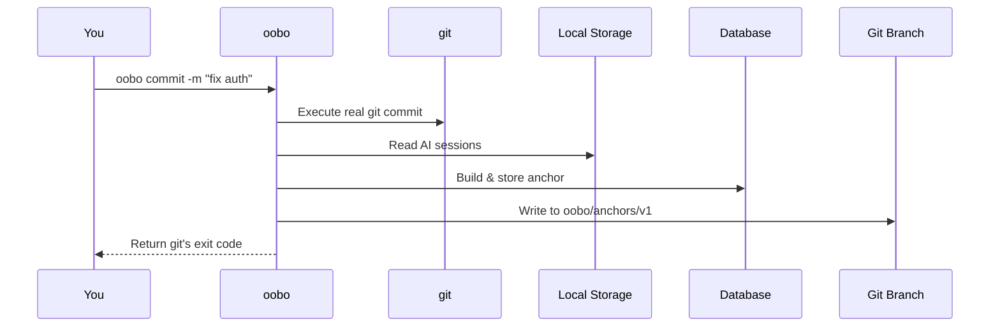

## What is oobo?

**oobo** is a transparent git decorator that enriches every commit with AI context: sessions, tokens, and code attribution. It bridges the gap between your AI coding conversations and your git history.

AI coding tools generate conversations, token usage, and context that disappear the moment you close the tab. Meanwhile, `git log` only shows diffs — it has no idea that Claude wrote that function or that you spent 14k tokens debugging a race condition.

**oobo solves this problem.** On every write operation (commit, push, merge), oobo captures the AI sessions that contributed to the change and writes structured metadata called an **anchor**.

<CardGroup cols={2}>
  <Card title="No workflow changes" icon="wand-magic-sparkles">
    Use oobo exactly like git. All commands pass through transparently.
  </Card>
  <Card title="No plugins required" icon="puzzle-piece">
    Works with your existing AI tools — no integrations to install.
  </Card>
  <Card title="No cloud required" icon="server">
    Everything stays local unless you configure an endpoint.
  </Card>
  <Card title="Read-only access" icon="lock">
    Never writes to AI tool directories. Privacy-first by design.
  </Card>
</CardGroup>

## How it works

Oobo sits between you and git, intercepting write operations to capture AI context:



<Steps>
  <Step title="Execute real git command">
    Oobo runs the actual `git commit` command unchanged
  </Step>
  <Step title="Detect write operation">
    Intercepts commits, pushes, and merges
  </Step>
  <Step title="Read AI sessions">
    Pulls session data from local tool storage directories
  </Step>
  <Step title="Build anchor metadata">
    Creates structured record: commit + sessions + tokens + attribution
  </Step>
  <Step title="Write anchor">
    Stores in local SQLite DB and git orphan branch `oobo/anchors/v1`
  </Step>
  <Step title="Fire event (optional)">
    Sends to configured endpoint if transparency mode is enabled
  </Step>
  <Step title="Return unchanged">
    Returns git's exit code — transparent to your workflow
  </Step>
</Steps>

<Note>
  Read operations (`status`, `log`, `diff`, etc.) pass straight through to git with **zero overhead**.
</Note>

## The anchor concept

An **anchor** is oobo's core primitive — it extends a git commit with AI context:

```
Git:   commit = diff(files)
Oobo:  anchor = commit + sessions + tokens + attribution
```

Each anchor records:
- Which AI sessions contributed
- Token counts (input/output per model)
- Code attribution (AI vs human lines)
- Model used and session duration
- Session transcripts (local only by default)

Anchors live in:
1. **Local SQLite database** (`~/.oobo/oobo.db`) for fast queries
2. **Git orphan branch** (`oobo/anchors/v1`) that syncs with your repo

The orphan branch is created automatically on your first intercepted commit — metadata travels with your code.

## Supported AI tools

Oobo integrates with the tools you already use:

| Tool | Sessions | Transcripts | Token Stats | Agent Hooks |
|------|:--------:|:-----------:|:-----------:|:-----------:|
| **Cursor** | ✓ | ✓ | ✓ | ✓ |
| **Claude Code** | ✓ | ✓ | ✓ | ✓ |
| **Gemini CLI** | ✓ | ✓ | ✓ | ✓ |
| **OpenCode** | ✓ | ✓ | ✓ | ✓ |
| **Codex CLI** | ✓ | ✓ | ✓ | — |
| **Aider** | ✓ | ✓ | ✓ | — |
| **GitHub Copilot Chat** | ✓ | ✓ | ✓ | — |
| **Windsurf** | ✓ | ✓ | partial | — |
| **Zed** | ✓ | ✓ | ✓ | — |
| **Trae** | ✓ | ✓ | partial | — |

<Tip>
  All tools are **read-only** — oobo never writes to AI tool data directories.
</Tip>

### Agent hooks

For tools that support it (Cursor, Claude Code, Gemini CLI, OpenCode), oobo installs lifecycle hooks that track when agent sessions start and end. This enables real-time session linking during commits, rather than relying on time-window correlation.

## Why oobo?

<CardGroup cols={2}>
  <Card title="For developers" icon="code">
    Track which AI sessions contributed to each commit. Understand your AI-assisted coding patterns and productivity.
  </Card>
  <Card title="For teams" icon="users">
    See code attribution across your team. Know which changes came from AI assistance vs manual coding.
  </Card>
  <Card title="For agents" icon="robot">
    Built for autonomous agents that commit constantly. Use `--agent` flag for structured JSON output on every command.
  </Card>
  <Card title="For compliance" icon="shield-check">
    Audit trail of AI involvement. Token usage tracking. Secret redaction with gitleaks patterns.
  </Card>
</CardGroup>

## Key features

### Session browsing

```bash
oobo sessions              # Interactive TUI
oobo sessions --all        # Sessions across all projects
oobo sessions search "auth bug"  # Keyword search
```

The TUI shows source, model, tokens, duration, and title for each session. Select one to scroll through the full conversation.

### Analytics

```bash
oobo stats                 # Tokens, attribution, productivity
oobo stats --project myapp # Per-project
oobo stats --tool cursor   # Per-tool
oobo stats --since 30d     # Time-filtered
```

### Enriched commit history

```bash
oobo anchors               # Recent commits with AI context
oobo anchors --agent       # JSON output
```

See which AI sessions contributed to each commit, with token counts and attribution.

### Developer card

```bash
oobo card                  # Generate AI-first developer stats
oobo card --out dev.md     # Save to custom path
```

Generates a shareable overview of your AI tool usage — sessions, tokens, models, AI code percentage. No project names or private data included.

## Privacy & security

<CardGroup cols={2}>
  <Card title="Local by default" icon="house">
    Everything stays in `~/.oobo/`. Nothing leaves your machine unless you configure an endpoint.
  </Card>
  <Card title="Read-only" icon="eye">
    Never writes to AI tool directories. Only reads session metadata.
  </Card>
  <Card title="Secret redaction" icon="user-secret">
    Sessions scrubbed with gitleaks patterns before any sharing.
  </Card>
  <Card title="No telemetry" icon="phone-slash">
    Oobo does not phone home. Your data is yours.
  </Card>
</CardGroup>

<Warning>
  Config files containing API keys are automatically protected with `chmod 0600`.
</Warning>

## Next steps

<CardGroup cols={2}>
  <Card title="Installation" icon="download" href="/installation">
    Get oobo installed on your system
  </Card>
  <Card title="Quick Start" icon="rocket" href="/quickstart">
    From zero to first commit with AI context
  </Card>
  <Card title="Configuration" icon="gear" href="/guides/configuration">
    Configure endpoints, tools, and transparency mode
  </Card>
  <Card title="For AI Agents" icon="robot" href="/agents/overview">
    Using oobo from autonomous agents
  </Card>
</CardGroup>
